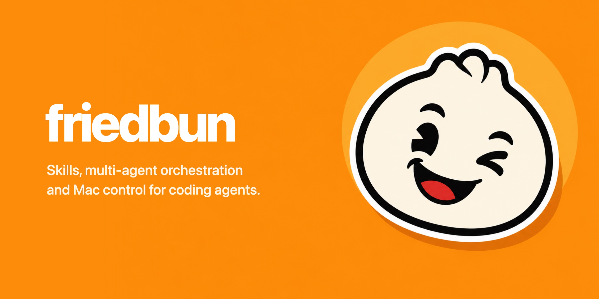
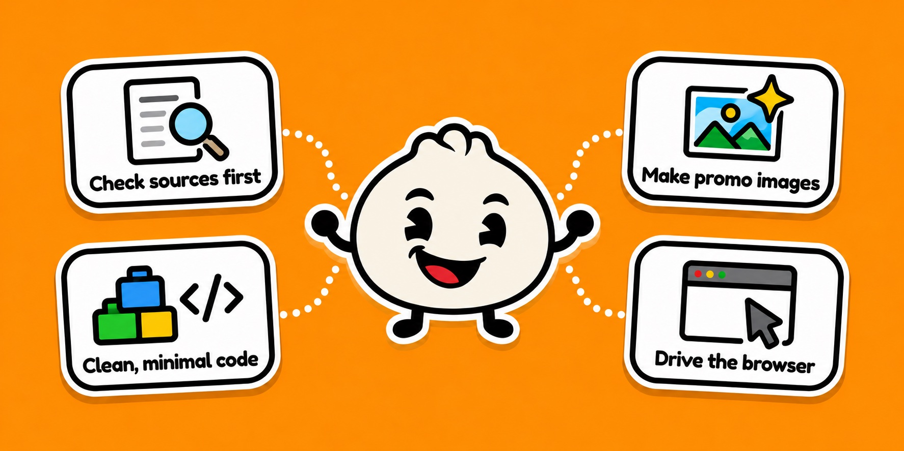
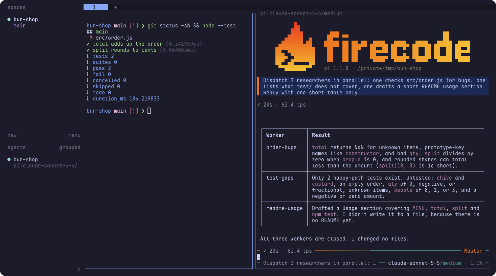
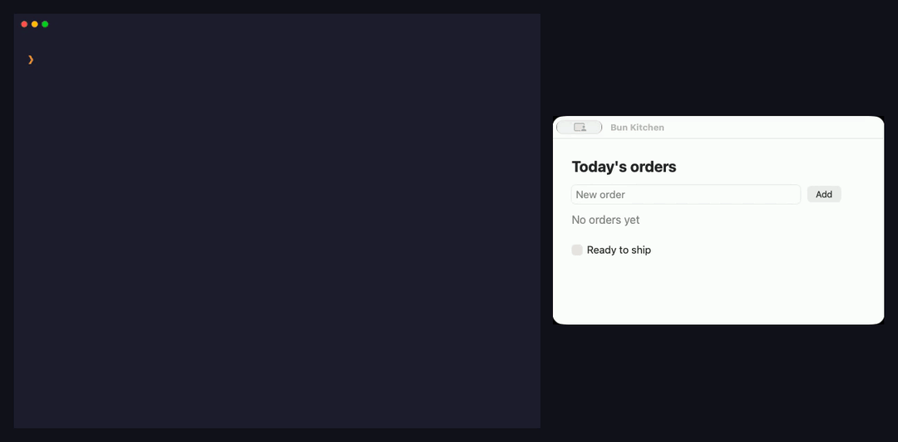

<p align="center"></p>

<p align="center"><a href="README.md">中文</a> · <b>English</b></p>

25 skills, multi-agent orchestration with FireCode, and an agent that takes over your whole Mac. One message sets it all up.

Just the skills (the skills CLI installs them into Claude Code, Codex, Cursor, Gemini CLI, GitHub Copilot and 70+ other agents):

```bash
npx skills add Suge8/friedbun
```

For everything, paste this to your coding agent:

```text
Clone https://github.com/Suge8/friedbun and set up this Mac by following its SETUP.md.
```

## In action

### Your agent works the way good engineers do

25 skills show it the proven way to do things: check primary sources before answering, keep the code minimal and the architecture clean, make promo images, drive a browser, and more.

<p align="center"></p>

### A terminal set up for agents

Ghostty, Herdr panes and a Starship prompt, with Pi and FireCode running in the same window. The colors are Catppuccin and follow your system's light or dark mode.

<p align="center"></p>

### One agent runs a team

With [FireCode](https://github.com/Suge8/firecode), one agent hands work to sub-agents running in parallel. Important changes get reviewed by several models at once; anything they fail goes back to the agent and is reviewed again until it passes.

<p align="center"></p>

### The agent runs your Mac

Your agent operates any app on your Mac by itself — in the background, without touching your mouse. Powered by [bcu](https://github.com/Suge8/better-computer-use).

<p align="center"></p>

<details>
<summary>What the full setup installs</summary>

- [Pi](https://pi.dev) coding agent with FireCode, my settings, keybindings and model roles, and my system prompt (`SYSTEM.md`). The prompt changes the agent's tone and habits; if you don't want that, restore the `.bak` it leaves behind.
- Terminal: [Herdr](https://herdr.dev), [Ghostty](https://ghostty.org), [Starship](https://starship.rs), fastfetch and a zsh snippet.
- bcu for Mac apps; [agent-browser](https://github.com/vercel-labs/agent-browser) and [CloakBrowser](https://cloakbrowser.dev) for the web, in a separate browser from the one you use.
- The skills, linked to `~/.agents/skills`.

The agent installs everything by itself. At the end it asks you for just two things: log in to your model account in Pi, and give bcu two macOS permissions (Accessibility and Screen Recording). Files you already have get a `.bak` copy first. [SETUP.md](SETUP.md) lists every file it touches.

</details>

If this saves you time, a ⭐ helps others find it.

Apple Silicon, macOS 14+ · [MIT](LICENSE) · by Fried Bun ([@Suge_dif](https://x.com/Suge_dif))
