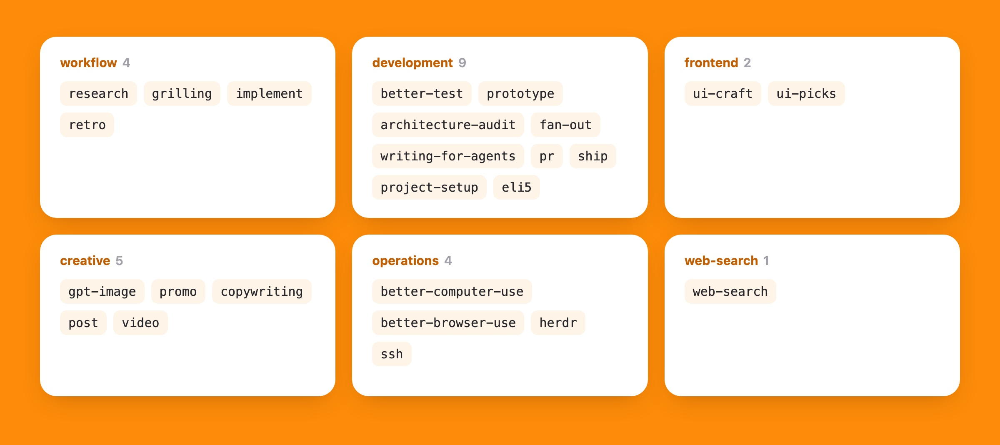

<p align="center"></p>

<p align="center"><b>English</b> · <a href="README.zh-CN.md">中文</a></p>

Skills, a multi-agent team and desktop control for your coding agent, set up from one link.

**Just the skills**

```bash
npx skills add Suge8/friedbun
```

**Everything** — paste this to your coding agent:

```text
Clone https://github.com/Suge8/friedbun and set up this Mac by following its SETUP.md.
```

## A playbook: 25 skills

<p align="center"></p>

Your agent picks up how I work: research from primary sources, write the failing test before the code, check UI against a taste guide, make images and demo GIFs like the ones on this page. Many of them kick in on their own when the task fits.

## A team: FireCode

<p align="center"></p>

One agent becomes a commander that hands work to sub-agents running in parallel, each on its own model. Several models review your change in parallel, and anything they fail goes straight back to be fixed. [FireCode on GitHub →](https://github.com/Suge8/firecode)

## Hands: bcu

<p align="center"></p>

Your agent clicks, types and scrolls through Mac apps by itself, so it can finish tasks in apps that have no API. It works in the background whenever the app allows, so your own mouse and keyboard stay yours. [bcu on GitHub →](https://github.com/Suge8/better-computer-use)

<details>
<summary><b>Everything the setup installs</b></summary>

- **Coding agent**: [Pi](https://pi.dev) with FireCode, my settings, keybindings and model roles, plus `SYSTEM.md`, my system prompt. The prompt swaps in my tone and working habits, so your agent flags it first and you can skip it.
- **Terminal**: [Herdr](https://herdr.dev) multiplexer, [Ghostty](https://ghostty.org), [Starship](https://starship.rs), fastfetch and a zsh snippet, all following the system light/dark theme.
- **Desktop and web**: bcu, plus [agent-browser](https://github.com/vercel-labs/agent-browser) and [CloakBrowser](https://cloakbrowser.dev) in an isolated browser that never drives your everyday one.
- **Skills**: [`skills/`](skills), linked to `~/.agents/skills`. `workflow` is forked from [mattpocock/skills](https://github.com/mattpocock/skills).

Existing config files are backed up as `.bak` before anything changes. The agent stops for the steps only you can do: logging in, granting macOS permissions, pasting an API key. [SETUP.md](SETUP.md) lists every file it touches.

</details>

Requires an Apple Silicon Mac on macOS 14+ (the full setup also needs Homebrew and Node 22.13+). [MIT](LICENSE) · made by Fried Bun · [@Suge_dif](https://x.com/Suge_dif)
