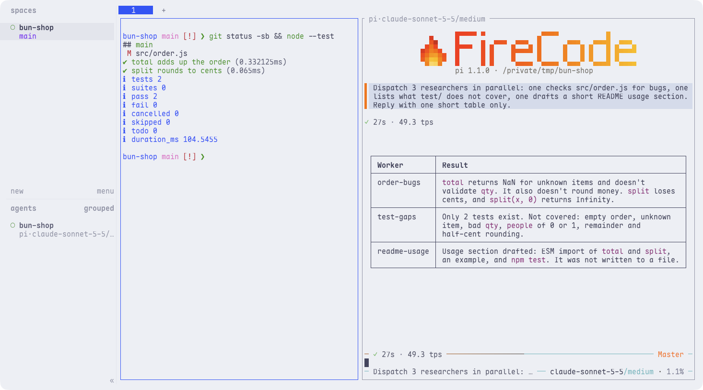

<p align="center"></p>

<p align="center"><a href="README.md">English</a> · <b>中文</b></p>

25 个 skill、FireCode 多代理编排，还能让 agent 操作 Mac 应用，一个链接装好。

只要 skills（用 skills CLI 可以装进 Claude Code、Codex、Cursor、Gemini CLI、GitHub Copilot 等七十多种 agent）：

```bash
npx skills add Suge8/friedbun
```

要整套配置，把这句话发给你的 coding agent：

```text
克隆 https://github.com/Suge8/friedbun，按其中的 SETUP.md 把这台 Mac 配好。
```

## 实际效果

### agent 能直接操作你的 Mac

agent 自己在计算器里算好账单，再写进文本编辑。全程在后台，你的鼠标照常用。靠的是 [bcu](https://github.com/Suge8/better-computer-use)。

<p align="center"></p>

### 一个 agent 带一队子代理

用 [FireCode](https://github.com/Suge8/firecode)，一个 agent 把活派给几个并行的子代理。重要的改动由几个不同模型同时审查，没通过的退回给 agent 修，修完再审，直到通过。

<p align="center"></p>

### 为 agent 配好的终端

Ghostty、Herdr 分屏和 Starship 提示符，Pi 和 FireCode 跑在同一个窗口里。Catppuccin 配色，跟随系统深浅色。

<p align="center">
  <picture>
    <source media="(prefers-color-scheme: dark)" srcset="assets/terminal-dark.png">
    
  </picture>
</p>

## 里面有什么

- **workflow**：查一手资料、挑计划的毛病、先写测试再实现、事后复盘一次会话。
- **development**：测试、原型、架构体检、子代理调研、PR 描述、发版。
- **frontend**：界面品味指南和组件选型表。
- **creative**：出图、宣传图和演示动图、产品文案、社媒帖、视频。
- **operations**：操作 Mac 应用（bcu）和浏览器（better-browser-use），控制 Herdr 终端窗格，通过 SSH 管服务器。
- **web-search**：联网搜索、抓网页正文。

每个 skill 是 [`skills/`](skills) 下的一个文件夹。`workflow` 最早分叉自 [mattpocock/skills](https://github.com/mattpocock/skills)。

<details>
<summary>整套配置会装什么</summary>

- [Pi](https://pi.dev) coding agent 加 FireCode，我的设置、快捷键、模型角色，以及我的系统提示词 `SYSTEM.md`。它会改变 agent 的语气和习惯，所以 agent 会先提醒你，不想要可以跳过。
- 终端：[Herdr](https://herdr.dev)、[Ghostty](https://ghostty.org)、[Starship](https://starship.rs)、fastfetch 和一段 zsh 配置。
- 操作 Mac 应用的 bcu；操作网页的 [agent-browser](https://github.com/vercel-labs/agent-browser) 和 [CloakBrowser](https://cloakbrowser.dev)，用的是单独的浏览器，不碰你平时用的那个。
- skills，链接到 `~/.agents/skills`。

你已有的文件改动前会先留一份 `.bak`。需要你本人的时候 agent 会停下：登录、给 macOS 授权、填 API key。[SETUP.md](SETUP.md) 列出了它改动的每个文件。

</details>

如果它帮你省了时间，点个 ⭐ 能让更多人看到。

Apple Silicon、macOS 14+ · [MIT](LICENSE) · 作者 Fried Bun（[@Suge_dif](https://x.com/Suge_dif)）
